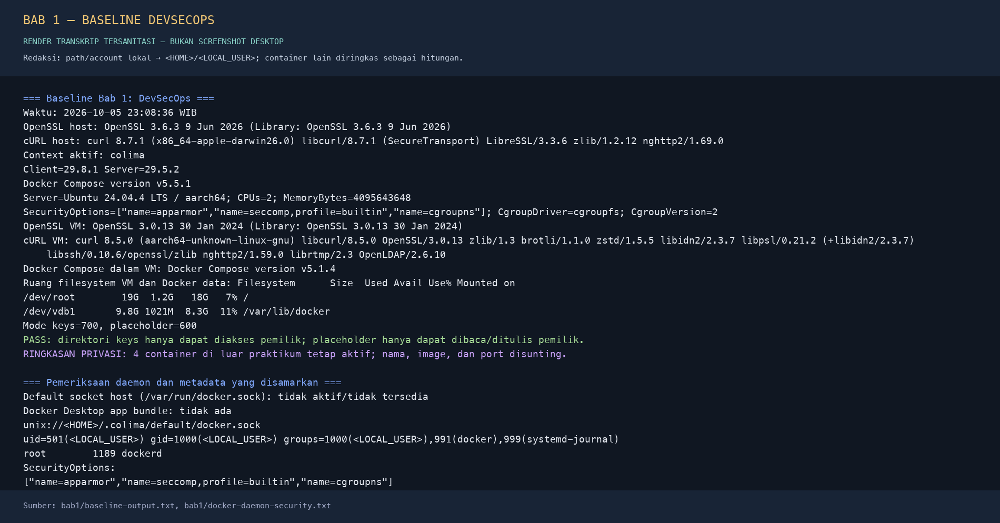

# Bab 1 — Fondasi Sosio-Teknis dan Baseline DevSecOps

**Nama:** Andi Rayka C  
**NRP:** 3123640021  
**Kelas:** D4 LJ Informatika  
**Tanggal praktikum:** 5 Oktober 2026

## 1. Pendahuluan

### 1.1 Latar Belakang

Organisasi perangkat lunak dituntut mengirim perubahan dengan cepat, tetapi kecepatan rilis tidak menghilangkan risiko salah konfigurasi, kerentanan dependensi, pencurian kredensial, atau perubahan tanpa jejak audit. DevOps membantu pengembangan dan operasi bekerja pada alur perubahan yang sama melalui umpan balik singkat dan otomatisasi. DevSecOps memperluas cara kerja itu dengan menjadikan keamanan bagian dari keputusan desain, pekerjaan harian, proses rilis, dan pengoperasian layanan.

Karena itu DevSecOps bukan sekadar memasang *scanner* pada *pipeline*. Sistemnya mencakup orang yang menetapkan tanggung jawab, proses yang menentukan kapan temuan harus ditangani, teknologi yang menjalankan kontrol, dan tata kelola yang mengatur pengecualian serta bukti. Alat yang sama dapat memberi hasil berbeda jika aturan ambang, identitas pelaksana, atau versi basis datanya berubah. Praktikum ini menyiapkan fondasi tersebut: memahami kerangka kerja, menentukan batas ancaman laboratorium, lalu merekam baseline yang benar-benar dapat diperiksa ulang.

### 1.2 Tujuan

1. Menjelaskan DevSecOps sebagai sistem sosio-teknis yang menghubungkan manusia, proses, teknologi, dan tata kelola.
2. Memetakan tujuan pengamanan ke NIST SSDF, panduan OWASP, serta SLSA tanpa menganggap salah satunya menggantikan yang lain.
3. Membedakan *shift-left*, *shift-right*, *security gate*, dan *evidence* yang dapat diaudit.
4. Membuat baseline direktori dan izin akses, menginventarisasi opsi keamanan Docker, serta menyusun model ancaman awal.
5. Merekam kondisi awal secara jujur agar percobaan berikutnya dapat dibandingkan dan diulang.

### 1.3 Ruang Lingkup

Praktikum dilakukan pada Mac Apple Silicon dengan Docker CLI yang terhubung ke Docker Engine di VM Colima Ubuntu ARM64. Tidak ada instalasi ulang Docker, perubahan konfigurasi sistem, pemindaian target eksternal, maupun pembuatan kredensial nyata. Direktori `keys/` hanya berisi berkas placeholder non-rahasia. Hasil pemeriksaan adalah baseline laboratorium, bukan sertifikasi keamanan atau bukti bahwa aplikasi produksi telah memenuhi suatu tingkat jaminan.

## 2. Dasar Teori

### 2.1 DevSecOps sebagai Sistem Sosio-Teknis

Keamanan *delivery* bergantung pada keselarasan beberapa unsur. **Manusia** menetapkan kepemilikan layanan, melakukan tinjauan, dan menindaklanjuti risiko. **Proses** menerangkan alur perubahan, persetujuan, penanganan insiden, dan batas pengecualian. **Teknologi** menjalankan pengujian, mengisolasi lingkungan, dan mengumpulkan telemetri. **Tata kelola** menentukan risiko yang dapat diterima, siapa yang boleh menyetujui pengecualian, serta berapa lama keputusan itu berlaku. Jika salah satu unsur tidak berjalan, hasil alat saja tidak menjamin masalah diperbaiki.

Pembagian tanggung jawab tidak seharusnya memindahkan risiko ke satu tim. Pengembang bertanggung jawab pada desain, kode, dan dependensi yang dipilih; operasi menjaga lingkungan build dan runtime; fungsi keamanan membantu menetapkan kontrol dan menilai temuan. Pemilik produk tetap menentukan prioritas risiko bisnis. Temuan yang lolos dari satu tahap harus kembali menjadi masukan bagi tahap lain, bukan berhenti sebagai laporan yang tidak memiliki penanggung jawab.

### 2.2 NIST SSDF, OWASP, dan SLSA

NIST SP 800-218 versi 1.1 menyajikan praktik pengembangan perangkat lunak aman yang dapat diintegrasikan ke SDLC yang telah digunakan organisasi [1]. Empat kelompok praktiknya adalah:

| Kelompok SSDF | Arah praktik | Contoh penerapan pada alur DevSecOps |
| --- | --- | --- |
| Prepare the Organization (PO) | Menyiapkan peran, proses, dan lingkungan | Menetapkan pemilik risiko, baseline tool, serta aturan rilis |
| Protect the Software (PS) | Melindungi kode dan komponen dari perubahan atau akses tidak sah | Kontrol akses repositori, perlindungan rahasia, dan integritas artefak |
| Produce Well-Secured Software (PW) | Menghasilkan perangkat lunak dengan risiko kerentanan yang lebih rendah | Tinjauan desain, pengujian keamanan, dan pengelolaan dependensi |
| Respond to Vulnerabilities (RV) | Menangani kerentanan yang ditemukan setelah perangkat lunak dibuat atau dirilis | Triase, perbaikan, pemberitahuan, dan pembelajaran dari insiden |

OWASP DevSecOps Guideline mendorong pengamanan yang ditempatkan pada alur pengembangan dan pipeline, termasuk pemeriksaan rahasia, SAST, analisis komposisi perangkat lunak, pemeriksaan IaC, dan kontrol rantai pasok [2]. OWASP juga mengingatkan bahwa pipeline CI/CD sendiri merupakan permukaan serangan: identitas otomatisasi sering memiliki akses luas, sehingga konfigurasi SCM, kredensial, plugin, runner, log, dan persetujuan rilis perlu diamankan [3]. Daftar alat harus mengikuti risiko dan arsitektur; semakin banyak pemindai tidak otomatis berarti kontrol lebih baik.

SLSA adalah spesifikasi jaminan rantai pasok yang membantu konsumen menilai asal dan proses pembuatan artefak melalui *provenance* serta tingkat kontrol yang bertahap [4]. Versi 1.2 menguraikan Build Track dan Source Track. Sebagai contoh, provenance Build L1 menunjukkan informasi tentang bagaimana artefak dibangun, sedangkan tingkat lebih tinggi menambah jaminan seperti provenance yang ditandatangani oleh platform build terkelola dan platform build yang diperkuat. Provenance membantu menelusuri masukan dan proses; ia tidak dengan sendirinya membuktikan bahwa kode bebas kerentanan. Karena itu SLSA melengkapi, bukan menggantikan, praktik SSDF maupun pemeriksaan OWASP.

### 2.3 Shift-Left, Shift-Right, Gate, dan Evidence

| Konsep | Waktu dan maksud | Contoh kontrol | Bukti yang perlu disimpan |
| --- | --- | --- | --- |
| *Shift-left* | Mengurangi biaya perbaikan dengan menemukan risiko sedini mungkin | Pemodelan ancaman, tinjauan desain, pemeriksaan rahasia dan dependensi saat perubahan dibuat | Commit/revisi masukan, konfigurasi pemeriksaan, versi alat, hasil, dan keputusan peninjau |
| *Shift-right* | Melanjutkan pemeriksaan setelah layanan dijalankan | Log terstruktur, pemantauan, uji dinamis yang terotorisasi, deteksi anomali, dan respons insiden | Waktu, sumber telemetri, versi layanan, temuan, pemilik, serta tindak lanjut |
| *Security gate* | Mengubah aturan risiko menjadi keputusan yang konsisten | Gagal menahan rilis untuk kondisi terlarang; pengecualian harus beralasan, memiliki pemilik, dan kedaluwarsa | Aturan yang dievaluasi, hasil, status lulus/gagal, persetujuan, dan referensi pengecualian |
| *Evidence* | Membuat klaim kontrol dapat diuji pihak lain | Menautkan hasil pemindaian ke revisi kode, artefak, konfigurasi, dan identitas pelaksana | Log asli, metadata waktu, versi tool, hash artefak, serta retensi yang terlindungi |

Gate yang baik memiliki kriteria eksplisit, bukan hanya pesan “scanner lulus”. Kebijakan harus menerangkan kelas temuan yang memblokir, bagaimana temuan *false positive* ditangani, siapa yang boleh memberi pengecualian, dan bagaimana keputusan itu ditinjau ulang. Evidence harus cukup untuk merekonstruksi keputusan tanpa membocorkan rahasia; token dan kata sandi tidak boleh dimasukkan ke log.

### 2.4 Baseline Laboratorium dan Model Ancaman

Baseline mencatat kondisi sebelum eksperimen: sistem operasi dan arsitektur, versi client dan server, konfigurasi runtime yang relevan, ruang penyimpanan, struktur direktori, dan izin file. Baseline tidak membuktikan semua kontrol aktif, tetapi memudahkan analisis ketika hasil berubah. Model ancaman menghubungkan aset, aktor, jalur serangan, dampak, dan mitigasi. Pada laboratorium ini asetnya mencakup kode aplikasi, kebijakan, laporan/SBOM, rahasia potensial, serta akses ke daemon Docker.

Direktori `keys/` diperlakukan lebih ketat daripada direktori kode biasa. Mode `700` pada direktori membatasi akses ke pemilik; mode `600` pada berkas membatasi baca dan tulis ke pemilik. `.gitignore` mengurangi kemungkinan file sensitif ikut terunggah, tetapi bukan kontrol akses dan tidak menghapus rahasia yang pernah terlanjur masuk ke riwayat repositori. Direktori laporan, SBOM, dan kunci tidak diletakkan di *web root* dan tidak dipasang ke container web.

Opsi `SecurityOptions` Docker menggambarkan mekanisme yang dilaporkan daemon, bukan penilaian lengkap atas keamanan host. Dalam hasil praktikum, Engine di VM melaporkan AppArmor, profil seccomp bawaan, dan namespace cgroup. Ini berguna sebagai bukti konfigurasi runtime, tetapi tidak membuktikan bahwa setiap container telah diberi batas resource atau hak akses yang sesuai.

## 3. Pelaksanaan Praktikum

### 3.1 Persiapan dan Baseline

Docker telah tersedia melalui context `colima`; oleh sebab itu praktikum menggunakan engine yang sudah berjalan dan tidak menjalankan installer, tidak mengubah socket default, serta tidak memasang Docker Desktop. Skrip baseline berikut merekam versi host dan VM, opsi keamanan daemon, ruang disk, dan izin direktori:

```bash
bash lab/bab1/run-baseline.sh
```

Skrip membuat struktur kerja lokal berikut. Isinya hanya berkas `.gitignore` dan placeholder teks, bukan kunci atau credential:

```text
devsecops-lab/
|-- app/
|-- policy/
|-- reports/
|-- sbom/
|-- keys/
|   `-- README-placeholder.txt
`-- .gitignore
```

Skrip menetapkan `keys/` ke mode `700` dan placeholder ke mode `600`, lalu memeriksa kembali mode aktual dengan `stat` dan `ls`. Perintah `docker info` dipakai untuk merekam versi server serta `SecurityOptions`. Pemeriksaan konteks dan privilege daemon dicatat terpisah; perintah-perintah ini tidak mengubah konfigurasi sistem.

### 3.2 Dokumentasi Hasil Baseline

Log perintah aktual yang telah disanitasi disimpan pada [baseline-output.txt](../evidence/bab1/baseline-output.txt), sedangkan pemeriksaan socket dan privilege daemon disimpan pada [docker-daemon-security.txt](../evidence/bab1/docker-daemon-security.txt). Path home/socket diganti dengan `<HOME>`, nama akun lokal dengan `<LOCAL_USER>`, dan daftar empat container di luar praktikum diringkas; hasil teknis tetap dipertahankan. Gambar berikut adalah **render cuplikan dari transkrip tersanitasi**, bukan screenshot desktop.



### 3.3 Model Ancaman Awal

| Aset | Aktor dan jalur ancaman | Dampak | Kontrol awal dan evidence |
| --- | --- | --- | --- |
| `keys/` dan credential | Pengembang atau proses lokal tidak sah membaca file dengan izin longgar; rahasia tidak sengaja masuk ke VCS | Penyalahgunaan identitas, pemalsuan rilis, akses ke layanan lain | Mode direktori `700`, file `600`, `.gitignore`, jangan simpan rahasia nyata di repo; buktikan dengan `stat` dan pemeriksaan secret |
| `policy/` | Perubahan tidak sah pada aturan gate atau pipeline | Kontrol dilemahkan dan artefak berisiko dapat lolos | Tinjauan perubahan, proteksi branch, pemisahan hak edit dan persetujuan; simpan revisi kebijakan serta hasil evaluasi |
| `reports/` dan `sbom/` | Publikasi tanpa autentikasi atau akses berlebihan | Informasi kerentanan dan inventaris komponen membantu reconnaissance | Jangan jadikan web root, batasi pembaca, tetapkan retensi; buktikan lokasi penyimpanan dan daftar akses |
| Source aplikasi | Backdoor, dependensi tercemar, atau secret tertanam | Kompromi build dan risiko pada pengguna | Review, lockfile, pemeriksaan SCA/secret, provenance; kaitkan hasil dengan revisi dan digest artefak |
| Docker socket dan daemon | Aplikasi atau pihak tidak sah memperoleh akses socket lalu mengirim API Docker | Kontrol daemon dapat memberi hak setara root di lingkungan daemon dan mengakses objek lain | **Rekomendasi:** batasi akses socket, jangan mount ke aplikasi, dan evaluasi VM/rootless. **Status praktikum:** container Bab 1–2 tidak menerima mount socket, tetapi ACL/akses socket daemon tidak diubah. |

**Pernyataan ancaman:** Jika pihak yang tidak berwenang dapat membaca rahasia, mengubah kebijakan, atau mengendalikan daemon Docker, pihak tersebut dapat mencuri identitas, mengubah aturan rilis, atau mengganti artefak tanpa terdeteksi. Eksposur laporan dan SBOM juga dapat membantu penyerang memilih target. Kontrol yang benar-benar diterapkan pada praktikum ini adalah pembatasan mode `keys/` dan placeholder, `.gitignore`, serta tidak memberikan mount socket kepada container praktikum. Tidak ada perubahan ACL atau konfigurasi akses socket; pembatasan akses daemon, mode rootless, dan penguatan VM tetap merupakan rekomendasi yang belum diterapkan maupun diuji pada pekerjaan ini.

## 4. Hasil dan Pembahasan

| Komponen | Hasil pengamatan |
| --- | --- |
| Host | macOS 27.0.1, Apple Silicon `arm64`; Git 2.47.1; OpenSSL 3.6.3; cURL 8.7.1 |
| Context dan endpoint | Context `colima`, socket `unix://<HOME>/.colima/default/docker.sock`; socket `/var/run/docker.sock` tidak aktif/tidak tersedia; Docker Desktop tidak terpasang |
| VM dan daemon | Colima menjalankan Ubuntu 24.04.4 LTS ARM64, 2 CPU dan 4 GiB RAM; Docker Engine 29.5.2; proses `dockerd` berjalan sebagai `root` |
| Compose | Plugin yang dipanggil dari host: 5.5.1; versi di VM: 5.1.4 |
| Penyimpanan Docker | Filesystem `/var/lib/docker`: 9.8G total, 8.3G tersedia pada saat pemeriksaan |
| Opsi keamanan Engine | `apparmor`, `seccomp (profile=builtin)`, `cgroupns`; cgroup v2 |
| Izin workspace | `keys/` = `700`; placeholder = `600`; direktori lain tidak berisi secret |

Host macOS dan VM Linux memiliki tool jaringan serta pustaka TLS yang berbeda. Di host, cURL 8.7.1 menampilkan target build `x86_64-apple-darwin` dan Secure Transport; di VM, cURL 8.5.0 berjalan pada ARM64 dan memakai OpenSSL 3.0.13. OpenSSL host juga lebih baru daripada OpenSSL VM. Karena itu, hasil uji TLS atau transfer jaringan harus mencatat di lingkungan mana perintah dijalankan; menyebut hanya “versi cURL” dapat menghilangkan perbedaan penting.

Keanggotaan grup `docker` **bukan** bukti bahwa daemon berjalan tanpa hak root. Dokumentasi Docker memperingatkan bahwa grup tersebut memberi hak setara root pada sistem daemon [5]. Hasil aktual menunjukkan proses `dockerd` sebagai `root` dan `SecurityOptions` tidak mencantumkan `rootless`; dengan demikian baseline ini bukan konfigurasi daemon rootless. User non-root dapat mengirim perintah Docker melalui socket, tetapi itu berbeda dari menjalankan daemon dalam Rootless mode. Socket Colima tetap aset sensitif: aplikasi tidak boleh diberi mount socket karena API daemon dapat dipakai untuk membuat workload berprivilege dan mengakses objek runtime lain. Praktikum tidak mengubah keanggotaan grup atau memasang socket ke container.

Pemeriksaan direktori hanya membuktikan mode izin pada placeholder yang dibuat untuk latihan. Tidak ada private key nyata yang diuji. Demikian pula, daftar AppArmor/seccomp/cgroup adalah pengamatan daemon VM, bukan jaminan keamanan macOS atau bukti bahwa kebijakan aplikasi telah lengkap. Pemodelan ancaman masih berupa baseline awal; tidak ada pipeline CI/CD atau security gate produksi yang dijalankan pada Bab ini.

## 5. Kesimpulan

DevSecOps menyatukan tanggung jawab manusia, proses, teknologi, dan tata kelola sepanjang siklus perangkat lunak. SSDF memberi kelompok praktik pengembangan aman, OWASP membantu menerjemahkannya menjadi kontrol pipeline dan operasional, sementara SLSA berfokus pada jaminan asal serta integritas rantai pasok. Ketiganya baru berguna ketika temuan menghasilkan keputusan yang jelas dan evidence yang menghubungkan input, tool, konfigurasi, hasil, serta tindak lanjut.

Baseline aktual berhasil dibuat tanpa instalasi ulang Docker atau perubahan konfigurasi permanen. Izin direktori sensitif dibatasi, opsi keamanan Engine dicatat, dan model ancaman awal memasukkan risiko Docker socket. Temuan pentingnya adalah daemon Colima berjalan sebagai root meskipun CLI digunakan oleh akun non-root; akses socket karena itu harus diperlakukan sebagai hak istimewa, bukan sebagai isolasi tambahan. Baseline ini menjadi titik pembanding bagi praktikum container pada Bab 2.

## 6. Daftar Pustaka

1. NIST. (2022). *Secure Software Development Framework (SSDF) Version 1.1, SP 800-218*. [NIST CSRC](https://csrc.nist.gov/pubs/sp/800/218/final).
2. OWASP Foundation. (n.d.). *OWASP DevSecOps Guideline*. [OWASP](https://owasp.org/projects/devsecops-guideline).
3. OWASP Foundation. (n.d.). *CI/CD Security Cheat Sheet*. [OWASP Cheat Sheet Series](https://cheatsheetseries.owasp.org/cheatsheets/CI_CD_Security_Cheat_Sheet.html).
4. OpenSSF. (n.d.). *SLSA Specification, Version 1.2*. [SLSA](https://slsa.dev/spec/v1.2).
5. Docker. (n.d.). *Linux post-installation steps: Manage Docker as a non-root user*. [Docker Docs](https://docs.docker.com/engine/install/linux-postinstall/).
