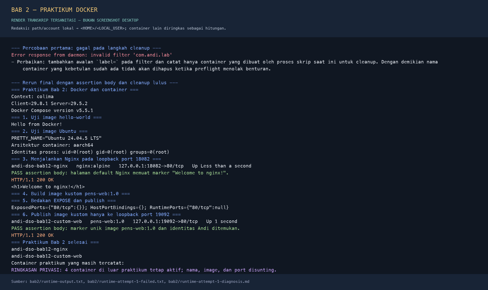

# Bab 2 — Konsep Container dan Praktik Docker

**Nama:** Andi Rayka C  
**NRP:** 3123640021  
**Kelas:** D4 LJ Informatika  
**Tanggal praktikum:** 5 Oktober 2026

## 1. Pendahuluan

### 1.1 Latar Belakang

Virtual machine dan container sama-sama membantu menjalankan workload secara terpisah, tetapi batas isolasi dan kebutuhan sumber dayanya berbeda. VM menyediakan perangkat keras virtual dan menjalankan sistem operasi tamu beserta kernelnya. Container Linux mengisolasi proses melalui fitur kernel sehingga beberapa container memakai kernel Linux yang sama. Container umumnya lebih cepat dibuat dan mudah dibagikan, tetapi bukan pengganti isolasi hypervisor untuk semua risiko.

Docker menyediakan antarmuka untuk membangun image, menjalankan container, mengelola jaringan dan volume, serta mengambil image dari registry. Pemahaman komponen tersebut penting dalam DevSecOps karena keputusan seperti pemilihan base image, hak akses proses, sumber image, pemetaan port, dan pengelolaan socket memengaruhi keamanan artefak dan runtime. Praktikum ini menggunakan Docker yang telah tersedia di VM Colima; fokusnya adalah menjalankan image resmi, membuat image web kustom, dan membuktikan secara langsung perbedaan metadata `EXPOSE` dengan port yang benar-benar dipublikasikan.

### 1.2 Tujuan

1. Membandingkan VM dan container dari sisi kernel, isolasi, overhead, dan penggunaan sumber daya.
2. Menjelaskan komponen Docker: CLI, Engine/daemon, API, registry, image, container, network, dan volume.
3. Menyebutkan prosedur instalasi resmi Docker Engine pada Ubuntu tanpa mengklaim prosedur itu telah dijalankan jika Docker sudah tersedia.
4. Menguji `hello-world`, Ubuntu 24.04, Nginx, dan image kustom `pens-web:1.0`.
5. Membuktikan status HTTP sekaligus isi body yang diharapkan, dan membedakan `EXPOSE` dari `--publish`.
6. Membersihkan hanya container yang dibuat untuk praktikum serta mempertahankan stack lain.

## 2. Dasar Teori

### 2.1 VM dan Container

VM memperoleh perangkat keras virtual dari hypervisor dan menjalankan guest OS dengan kernel sendiri. Container Linux adalah proses yang menggunakan kernel Linux pada mesin tempat container berjalan, dengan namespace untuk membatasi tampilan proses, jaringan, mount, dan identitas; cgroups mengukur atau membatasi penggunaan resource [2], [7]. Container tetap membutuhkan pengamanan kernel, runtime, konfigurasi, image, dan daemon. Root di dalam container tidak otomatis berarti root pada host, tetapi kelemahan isolasi atau akses daemon yang berlebihan dapat memperluas dampak.

| Aspek | Virtual machine | Container Linux |
| --- | --- | --- |
| Kernel | Guest OS memiliki kernel sendiri | Berbagi kernel Linux pada host runtime |
| Unit isolasi | Perangkat keras virtual melalui hypervisor | Proses dan namespace/cgroup pada kernel |
| Isi dasar | Guest OS, aplikasi, dan dependensi | Image aplikasi dan dependensi; tidak membawa kernel sendiri |
| Waktu mulai dan footprint | Biasanya lebih besar karena guest OS | Umumnya lebih kecil dan cepat dibuat |
| Kasus yang sesuai | OS berbeda, isolasi VM khusus, atau workload yang membutuhkan kernel tersendiri | Layanan terkemas, pengujian berulang, dan lingkungan CI/CD |

Pada praktikum ini terdapat dua lapisan yang perlu dibedakan: macOS menjalankan VM Colima Ubuntu 24.04.4, lalu Docker Engine di VM tersebut menjalankan container Linux. Container Ubuntu dan Nginx menggunakan kernel Linux pada VM Colima, bukan kernel macOS secara langsung. VM membantu menyediakan kernel Linux yang diperlukan di host macOS, sedangkan container mengemas workload di dalam VM itu.

### 2.2 Arsitektur Docker dan Siklus Image

Docker Engine memakai pola client-server. Docker CLI menerima perintah lalu berkomunikasi dengan daemon melalui Docker API; endpoint dapat berupa Unix socket atau endpoint jaringan. `dockerd` mengelola image, container, jaringan, dan volume. Dalam implementasi Engine, containerd mengelola siklus hidup container tingkat lebih tinggi dan runtime OCI seperti runc membuat proses terisolasi di Linux. Registry menyimpan dan mendistribusikan image; Docker Hub adalah registry publik yang digunakan image latihan [1].

Image adalah template read-only yang tersusun dari layer. Instruksi Dockerfile dapat menambah layer; image turunan menggunakan kembali layer dasar jika masih cocok. Saat container dibuat, Docker menambahkan *writable layer* tersendiri. Perubahan di layer itu biasanya hilang ketika container dihapus; data yang perlu bertahan harus disimpan pada volume atau bind mount sesuai kebutuhan [6]. Karena itu, tag seperti `nginx:alpine` memudahkan referensi tetapi dapat menunjuk isi berbeda pada waktu berbeda. Untuk build yang dapat direproduksi, catat atau pin digest dan simpan versi konfigurasi serta input build.

### 2.3 Instalasi Docker Engine pada Ubuntu

Docker Engine telah tersedia di profil Colima. Praktikum ini **menggunakan ulang engine yang ada** dan tidak menjalankan `apt`, tidak menghapus paket, tidak menambah grup, serta tidak memasang ulang Docker. Prosedur berikut hanya dokumentasi untuk mesin Ubuntu baru yang memang memerlukan instalasi, mengikuti repositori APT resmi Docker untuk Ubuntu 24.04 dan arsitektur yang didukung [3]; seluruh perintah di blok ini **belum dijalankan pada praktikum ini**.

```bash
sudo apt update
sudo apt install ca-certificates curl
sudo install -m 0755 -d /etc/apt/keyrings
sudo curl -fsSL https://download.docker.com/linux/ubuntu/gpg \
  -o /etc/apt/keyrings/docker.asc
sudo chmod a+r /etc/apt/keyrings/docker.asc

sudo tee /etc/apt/sources.list.d/docker.sources <<EOF
Types: deb
URIs: https://download.docker.com/linux/ubuntu
Suites: $(. /etc/os-release && echo "${UBUNTU_CODENAME:-$VERSION_CODENAME}")
Components: stable
Architectures: $(dpkg --print-architecture)
Signed-By: /etc/apt/keyrings/docker.asc
EOF

sudo apt update
sudo apt install docker-ce docker-ce-cli containerd.io \
  docker-buildx-plugin docker-compose-plugin
sudo docker run hello-world
```

Untuk sistem baru, administrator perlu meninjau prasyarat, sumber paket, arsitektur, aturan firewall, dan dampak versi sebelum menjalankan instalasi. Mengikuti langkah post-install untuk menjalankan CLI tanpa `sudo` tidak membuat daemon rootless: dokumentasi Docker menyatakan daemon Docker secara default berjalan sebagai `root` dan grup `docker` memberikan hak setara root pada sistem daemon [4]. Rootless adalah mode daemon terpisah yang perlu dikonfigurasi secara eksplisit. Socket daemon karena itu merupakan aset sensitif dan tidak boleh dipasang ke container aplikasi hanya demi kemudahan.

### 2.4 `EXPOSE` dan Port Publish

`EXPOSE` di Dockerfile mendokumentasikan port container yang dimaksudkan untuk digunakan aplikasi; instruksi ini sendiri tidak membuat port host dan tidak mem-publish port secara otomatis. `docker run -p HOST_IP:HOST_PORT:CONTAINER_PORT` membuat pemetaan port saat container dijalankan. Jika alamat host tidak diberikan, Docker biasanya membuka port pada semua interface; pengikatan ke `127.0.0.1` membatasi akses ke loopback host [5]. Port publish bukan pengganti autentikasi, TLS, atau kontrol jaringan produksi.

## 3. Pelaksanaan Praktikum

### 3.1 Kondisi Awal dan Pilihan Instalasi

Docker Desktop tidak ada, socket Docker default `/var/run/docker.sock` tidak aktif, dan context aktif adalah `colima`. Context itu menunjuk ke socket VM `~/.colima/default/docker.sock`. Colima menjalankan Ubuntu 24.04.4 LTS ARM64 dengan 2 CPU dan 4 GiB RAM. Docker Engine 29.5.2 tersedia; Compose yang dipanggil dari host adalah 5.5.1, sementara Compose dari VM adalah 5.1.4. Karena engine sudah berfungsi, praktikum langsung menggunakan context tersebut tanpa mengubah konfigurasi permanen.

### 3.2 Langkah Praktikum

Skrip [run-practicum.sh](../lab/bab2/run-practicum.sh) menguji image resmi `hello-world`, menjalankan perintah pembacaan `/etc/os-release` dalam `ubuntu:24.04`, lalu membuat Nginx dengan binding loopback port `18082`. Berikutnya skrip membangun `pens-web:1.0` dari [Dockerfile](../lab/bab2/Dockerfile) dan [index.html](../lab/bab2/index.html). Port `19092` dipilih untuk web kustom. Port contoh `8080` dan `9090` tidak digunakan karena `8080` telah ditempati stack Bab 3; pemakaian loopback `18082` dan `19092` juga menghindari publikasi ke interface jaringan lain.

```bash
bash lab/bab2/run-practicum.sh
```

Untuk membedakan metadata image dengan publish aktual, skrip terlebih dahulu menjalankan image kustom tanpa `-p`, lalu membaca `Config.ExposedPorts`, `HostConfig.PortBindings`, dan `NetworkSettings.Ports`. Sesudah itu image yang sama dijalankan dengan `127.0.0.1:19092:80`. Validasi tidak berhenti pada status HTTP: respons Nginx harus memuat `Welcome to nginx!`, sedangkan web kustom harus memuat marker `DEVSECOPS-BAB2-ANDI-3123640021-PENS-WEB-1.0`.

### 3.3 Bukti Pelaksanaan

Log akhir perintah dan respons aktual yang telah disanitasi tersimpan di [runtime-output.txt](../evidence/bab2/runtime-output.txt). Bukti percobaan cleanup pertama dan diagnosisnya tetap disertakan di [runtime-attempt-1-failed.txt](../evidence/bab2/runtime-attempt-1-failed.txt) serta [runtime-attempt-1-diagnosis.md](../evidence/bab2/runtime-attempt-1-diagnosis.md). Render berikut mengambil cuplikan dari transkrip tersanitasi: metadata akun/path lokal diganti, dan empat container di luar praktikum diringkas, sementara kode status, marker body, mapping port, dan diagnosis tetap dipertahankan. Ini **bukan screenshot desktop**.



## 4. Hasil dan Pembahasan

### 4.1 Hasil Pengujian

| Pengujian | Hasil aktual | Kriteria lulus |
| --- | --- | --- |
| `hello-world` | Pesan `Hello from Docker!`; image menyebut `arm64v8` | Container menyelesaikan tugas dan menampilkan pesan sukses |
| Ubuntu | `ubuntu:24.04` menjalankan Ubuntu 24.04.5 LTS pada `aarch64`; proses `id` di dalam container menunjukkan UID 0 | `/etc/os-release`, arsitektur, dan identitas proses berhasil dibaca |
| Nginx | Container `andi-dso-bab12-nginx`, `127.0.0.1:18082->80/tcp`, HTTP 200 | Assertion body menemukan `Welcome to nginx!` |
| Image kustom | `pens-web:1.0`, Linux ARM64, port internal `80/tcp`; ID image akhir `sha256:6780de1ab825d7cf3f867ddc953aaab041cfea411e80f25e029e9cb9b6326b30` | Build sukses dan assertion body menemukan marker unik beridentitas praktikum |
| Hanya `EXPOSE` | `ExposedPorts={"80/tcp":{}}`; `HostPortBindings={}`; `RuntimePorts={"80/tcp":null}` | Metadata port ada tetapi belum ada pemetaan port host |
| Publish web kustom | `127.0.0.1:19092->80/tcp`, HTTP 200 | Body memuat marker `DEVSECOPS-BAB2-ANDI-3123640021-PENS-WEB-1.0` |
| Cleanup | Tidak ada container berlabel `com.andi.lab=devsecops-bab12` setelah skrip berakhir | Hanya container buatan praktikum dihapus; empat container pengguna tetap aktif |

Image dasar `nginx:alpine` yang digunakan pada build tercatat dengan digest `sha256:df221db836e1754089190208cee7eeda94f233197056426eda74a43ab1abeac2`. Pencatatan ini lebih kuat daripada hanya menulis tag, tetapi Dockerfile tetap memakai tag agar latihan sederhana dan mudah dibaca. Untuk pipeline yang menuntut build yang konsisten, base image sebaiknya dipin ke digest yang disetujui dan digest keluaran dicatat bersama provenance.

Pemeriksaan body menutup celah antara “server mengembalikan status sukses” dan “server yang benar mengembalikan isi yang diharapkan”. `curl --fail` memeriksa kegagalan HTTP, sedangkan `grep` terhadap marker memeriksa identitas konten. Assertion Nginx dan marker custom sama-sama lulus. Pengujian tanpa publish menunjukkan bahwa `EXPOSE 80` tercatat sebagai metadata tetapi tidak menciptakan port host. Sesudah `-p 127.0.0.1:19092:80`, Docker menampilkan binding eksplisit; hal ini menjaga latihan hanya tersedia lokal pada Mac.

### 4.2 Instalasi Ulang dan Troubleshooting

Instalasi Ubuntu tidak dijalankan karena Docker CLI dan server sudah berkomunikasi melalui Colima. Menjalankan installer ulang atau mengubah daemon tidak dibutuhkan untuk mencapai tujuan, berisiko mengganggu stack aktif, dan melanggar batas praktikum yang ditetapkan. Perbedaan versi Compose host dan VM dicatat, bukan disamarkan: praktikum menggunakan CLI host yang diarahkan ke context Colima.

Percobaan pertama menjalankan seluruh uji container dan HTTP dengan sukses, tetapi skrip berakhir dengan status 1 ketika menampilkan container berlabel. Penyebabnya adalah sintaks filter kurang awalan `label=`. Log dan diagnosis awal disimpan terpisah agar kegagalan tidak dihapus dari jejak. Perbaikan menambahkan filter yang benar dan membatasi cleanup pada container yang dicatat dibuat oleh skrip saat ini. Percobaan final kemudian lulus termasuk assertion body dan pemeriksaan tidak adanya container praktikum setelah cleanup. Image build tetap tersedia sebagai artefak lokal; tidak ada image, volume, atau container pengguna yang dihapus.

Container Ubuntu yang berjalan sebagai UID 0 hanya menunjukkan identitas proses di dalam container tersebut. Hal itu tidak membuktikan bahwa Docker Engine berjalan rootless atau bahwa container memiliki hak root pada macOS. Sebaliknya, `dockerd` Colima terbukti berjalan sebagai `root`; akses ke socket Docker memberikan kendali berprivilege terhadap daemon di VM. Praktikum tidak menggunakan `--privileged`, tidak me-mount socket, dan tidak mengubah grup sistem.

## 5. Kesimpulan

VM menyediakan guest OS dan kernel Linux, sedangkan container mengisolasi workload yang berbagi kernel tersebut. Docker memudahkan pengambilan image, build layer, pembuatan container, dan pemetaan port, tetapi setiap objek serta daemon tetap bagian dari batas keamanan yang harus dikelola. Praktikum nyata berhasil menjalankan `hello-world`, Ubuntu ARM64, Nginx, dan `pens-web:1.0`; kedua endpoint mengembalikan HTTP 200 dan body-nya lulus marker assertion.

Instalasi Docker pada Ubuntu didokumentasikan sebagai prosedur untuk host baru dan tidak dijalankan pada mesin ini. Pengujian metadata menunjukkan bahwa `EXPOSE` tidak sama dengan `--publish`. Pemetaan loopback menjaga layanan latihan tetap lokal, sementara cleanup terverifikasi hanya menghapus container yang dibuat praktikum. Hasil ini memperkuat pelajaran Bab 1: kontrol yang diklaim perlu dibuktikan dengan output, dan akses Docker harus diperlakukan sebagai hak istimewa.

## 6. Daftar Pustaka

1. Docker. (n.d.). *Docker overview and architecture*. [Docker Docs](https://docs.docker.com/get-started/docker-overview/).
2. NIST. (2017). *Application Container Security Guide, SP 800-190*. [NIST CSRC](https://csrc.nist.gov/pubs/sp/800/190/final).
3. Docker. (n.d.). *Install Docker Engine on Ubuntu*. [Docker Docs](https://docs.docker.com/engine/install/ubuntu/).
4. Docker. (n.d.). *Linux post-installation steps*. [Docker Docs](https://docs.docker.com/engine/install/linux-postinstall/).
5. Docker. (n.d.). *Publishing and exposing ports*. [Docker Docs](https://docs.docker.com/get-started/docker-concepts/running-containers/publishing-ports/).
6. Docker. (n.d.). *Storage*. [Docker Docs](https://docs.docker.com/engine/storage/).
7. Open Container Initiative. (n.d.). *OCI Runtime Specification: Linux container configuration*. [GitHub](https://github.com/opencontainers/runtime-spec/blob/main/config-linux.md).
