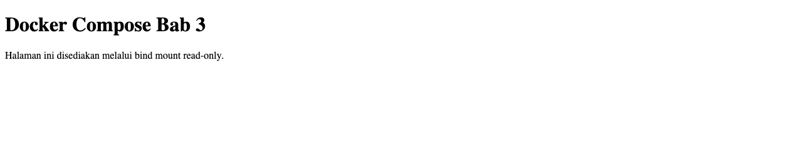

# BAB III — JARINGAN, PENYIMPANAN, DAN ORKESTRASI CONTAINER

**Nama:** Andi Rayka C · **NRP:** 3123640021 · **Kelas:** D4 LJ Informatika

## Pendahuluan

Aplikasi yang dipisah menjadi beberapa container tetap memerlukan jalur komunikasi yang terencana dan penyimpanan yang sesuai dengan umur datanya. Tanpa segmentasi, service yang tidak perlu dapat menjangkau basis data; tanpa volume yang tepat, data penting dapat hilang ketika container diganti. Sebaliknya, data sementara yang tidak perlu disimpan sebaiknya tidak ditinggalkan pada filesystem host.

Praktikum ini menguji tiga persoalan tersebut secara langsung: penemuan service melalui DNS pada *user-defined bridge*, perbedaan persistensi *named volume*, *bind mount*, dan `tmpfs`, serta orkestrasi Nginx, Flask, dan PostgreSQL dengan Docker Compose. Pengujian juga memeriksa kesehatan layanan, jalur API sampai ke PostgreSQL, serta pembatasan akses database dari jaringan frontend.

## Dasar Teori

### Jaringan bridge dan DNS service

Docker menyediakan jaringan bridge buatan pengguna sebagai segmen virtual bagi container. Container yang tergabung pada jaringan yang sama dapat menemukan nama service atau alias melalui DNS internal Docker; alamat IP-nya dapat berubah tanpa mengharuskan konfigurasi alamat statis. Keanggotaan jaringan menjadi batas keterjangkauan: jaringan frontend dapat menerima request dari host melalui port yang dipublikasikan, sementara jaringan backend dapat dibatasi untuk komunikasi antarlayanan.

Resolusi nama bukan pengganti autentikasi atau enkripsi. Fungsinya adalah *service discovery* dalam lingkup jaringan Docker; hak akses tetap perlu dibatasi melalui keanggotaan jaringan dan pemaparan port.

### Siklus hidup data

*Named volume* dikelola Docker di luar lapisan tulis container. Volume tetap ada ketika container dihapus, sehingga sesuai untuk data PostgreSQL, tetapi tetap membutuhkan backup dan kebijakan retensi. Backup adalah salinan terpisah yang dapat diperiksa dan dipulihkan; keberadaan volume saja belum membuktikan bahwa pemulihan dapat dilakukan.

*Bind mount* memetakan file atau direktori host ke container. Perubahan pada file sumber dapat terlihat tanpa membangun ulang image. Opsi *read-only* mengurangi kemungkinan proses dalam container mengubah berkas host, tetapi tidak menggantikan kontrol izin pada host.

`tmpfs` menempatkan data sementara pada memori container/host dan tidak menjanjikan persistensi setelah container dihentikan. Docker juga mencatat bahwa halaman memori dapat dipindahkan ke swap; karena itu, `tmpfs` bukan jaminan bahwa secret tidak pernah menyentuh storage atau pasti terhapus secara forensik. Mekanisme ini sesuai untuk data temporer, bukan untuk database atau log yang perlu dipertahankan.

### Docker Compose dan health check

Compose menyatakan service, jaringan, volume, secret, dan dependensi dalam satu konfigurasi. `depends_on` dengan `condition: service_healthy` menahan startup service pemakai sampai dependensinya melewati health check; hal ini lebih kuat daripada hanya menunggu proses container berjalan. Health check adalah sinyal kesiapan saat diuji, bukan pemantauan operasional jangka panjang atau jaminan bahwa setiap request berikutnya akan berhasil.

## Pelaksanaan Praktikum

### Lingkungan dan penyesuaian port

Pengujian dijalankan pada macOS 27.0.1 (arm64) melalui konteks Colima, dengan Docker Engine 29.5.2 dan Docker Compose 5.5.1; engine melaporkan arsitektur Linux `aarch64`. Stack lain yang telah berjalan masih menggunakan `127.0.0.1:8080`, sehingga praktikum baru mengikat Nginx hanya ke loopback pada port host `18083`. Nama proyek Compose `andi-dso-bab3` juga memisahkan container, network, dan volume dari proyek lain. Port PostgreSQL tidak dipublikasikan ke host.

Sumber konfigurasi dan pola aplikasi diadaptasi dari pekerjaan lokal DevOps Bab 3 yang sudah ada. Berkas dan resource lama tidak diubah. Runner membuat credential sintetis lokal dari `secrets/db_password.example` hanya bila credential runtime belum ada; file runtime berizin terbatas dan diabaikan Git. Nilainya tidak dicetak ke transcript.

### Langkah kerja

Runner yang menyimpan langkah praktikum dan assertion tersedia di `lab/bab3/verify_lab.sh`. Dari folder tugas, alur dijalankan dengan:

```bash
cd "DevOps/DevSecOps - Bab 1-4/lab/bab3"
bash verify_lab.sh
```

Urutan praktikum adalah sebagai berikut:

1. Membuat bridge `andi-dso-bab3-user-bridge`, menjalankan dua container Alpine dengan alias `server-a` dan `server-b`, lalu menguji DNS serta `ping` dari container pertama.
2. Menulis `activity.log` pada named volume `andi-dso-bab3-data-vol`, menghapus container penulis, membaca kembali file, dan membuat arsip `backups/andi-dso-bab3-data-vol.tar.gz` melalui container bantu yang me-mount volume sumber secara *read-only*.
3. Menaikkan Compose dengan proyek `andi-dso-bab3`: Nginx menyediakan halaman dari bind mount `html/`, Flask meneruskan query ke PostgreSQL, dan PostgreSQL menggunakan named volume `pg-data`.
4. Menguji endpoint `/api/` dan `/api/health`, resolusi nama `db` dari app, ketidakmampuan web me-resolve `db`, penolakan tulis pada bind mount, pembaruan file host tanpa rebuild, persistensi data PostgreSQL setelah `docker compose down`/`up`, dan hilangnya file `tmpfs` setelah `stop`/`start`.

Compose membagi layanan ke jaringan `frontend` dan `backend`; `backend` bersifat internal. Nginx hanya berada di frontend, PostgreSQL hanya berada di backend, dan Flask menjadi penghubung pada kedua jaringan. Pemeriksaan kesehatan Nginx menguji halaman statis, sedangkan health check Flask menjalankan query sederhana ke database. Endpoint publik `/api/` meneruskan request ke Flask dan memperoleh versi PostgreSQL sebagai bukti bahwa jalur aplikasi hingga database benar-benar berjalan.



## Hasil dan Pembahasan

Transcript pengujian lengkap tersimpan pada `evidence/bab3/runtime-results.txt`. Ringkasan di bawah ini hanya menyatakan hasil yang tampak pada run aktual tanggal 5 Oktober 2026.

| Pemeriksaan | Hasil aktual | Makna |
|---|---|---|
| DNS bridge | `server-a` menemukan `server-b` pada `172.24.0.3`; 3 dari 3 paket ping diterima, kehilangan 0%. | Alias berfungsi tanpa menetapkan alamat IP manual. |
| Volume dan backup | Setelah writer dihapus, `activity.log` tetap berisi catatan waktu. Arsip gzip memuat `activity.log` dan menghasilkan checksum SHA-256 pada transcript. | Volume terpisah dari umur container dan arsip berhasil dibuat serta dibaca daftarnya. |
| Compose dan health | `web`, `app`, dan `db` seluruhnya berstatus `healthy`; PostgreSQL tidak memiliki published port host. | Layanan siap pada jaringan yang ditetapkan dan database tidak dibuka ke host. |
| API dan segmentasi | `/api/` mengembalikan `status: ok` beserta versi PostgreSQL; `/api/health` mengembalikan `status: healthy`. App me-resolve `db`, sedangkan web gagal me-resolve nama tersebut. | App dapat mengakses database melalui backend; web tidak menjadi anggota jaringan backend. |
| Bind mount | Container web ditolak saat mencoba menulis `static.html`. Marker perubahan dari host langsung muncul pada respons HTTP tanpa rebuild image. | Mode baca-saja bekerja dan perubahan host tetap diteruskan melalui mount. |
| Retensi dan data sementara | Nilai `volume-data-survived` masih terbaca setelah Compose diturunkan dan dinaikkan kembali; file pada `tmpfs` tidak ditemukan setelah container dihentikan dan dijalankan lagi. | Named volume persisten dan `tmpfs` bersifat volatil pada siklus hidup yang diuji. |

Pemisahan jaringan terlihat dari hasil uji negatif, bukan hanya dari deklarasi YAML. Demikian juga, retensi diuji setelah container penulis atau stack Compose dihapus, bukan hanya dengan membaca data saat container masih aktif. Arsip volume pada praktikum ini berisi file demonstrasi; ia bukan backup PostgreSQL produksi. Untuk database nyata, backup logis seperti `pg_dump`, pengujian restore, enkripsi, dan penyimpanan terpisah tetap diperlukan.

Log startup Nginx mencatat pesan informasional bahwa entrypoint tidak dapat mengubah konfigurasi yang di-mount *read-only*. Proses tetap menyelesaikan startup, health check berhasil, dan request statis/API menerima HTTP 200. Pesan itu dicatat sebagai kondisi konfigurasi mount, bukan disamarkan sebagai kegagalan layanan.

## Kesimpulan

Pengujian membuktikan bahwa bridge buatan pengguna menyediakan DNS berbasis alias, sementara pemisahan frontend/backend membatasi service yang dapat menemukan database. Named volume bertahan setelah container dihapus dan dapat disalin ke arsip; bind mount memperlihatkan perubahan host sambil menolak penulisan dari container; `tmpfs` kehilangan isinya setelah container dihentikan. Pada stack Compose, tiga layanan mencapai status sehat dan API Flask berhasil berkomunikasi dengan PostgreSQL. Kombinasi segmentasi, health check, penyimpanan yang sesuai, dan backup terverifikasi memberi dasar yang lebih aman daripada hanya mengandalkan container yang sedang berjalan.

## Daftar Pustaka

1. Docker, “Networking overview,” dokumentasi Docker Engine. [https://docs.docker.com/engine/network/](https://docs.docker.com/engine/network/)
2. Docker, “Volumes,” dokumentasi Docker Engine. [https://docs.docker.com/engine/storage/volumes/](https://docs.docker.com/engine/storage/volumes/)
3. Docker, “Bind mounts,” dokumentasi Docker Engine. [https://docs.docker.com/engine/storage/bind-mounts/](https://docs.docker.com/engine/storage/bind-mounts/)
4. Docker, “tmpfs mounts.” [https://docs.docker.com/engine/storage/tmpfs/](https://docs.docker.com/engine/storage/tmpfs/)
5. Docker, “Compose file reference” dan “Control startup order.” [https://docs.docker.com/reference/compose-file/](https://docs.docker.com/reference/compose-file/) · [https://docs.docker.com/compose/how-tos/startup-order/](https://docs.docker.com/compose/how-tos/startup-order/)
6. PostgreSQL Global Development Group, “pg_isready.” [https://www.postgresql.org/docs/current/app-pg-isready.html](https://www.postgresql.org/docs/current/app-pg-isready.html)
