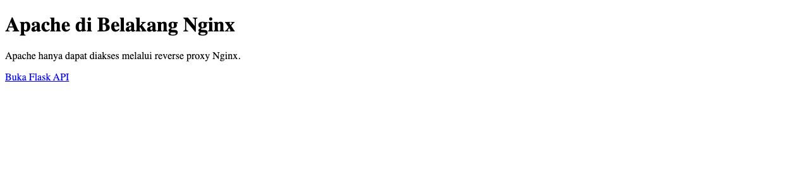

# BAB IV — WEB SERVER, REVERSE PROXY, DAN TLS

**Nama:** Andi Rayka C · **NRP:** 3123640021 · **Kelas:** D4 LJ Informatika

## Pendahuluan

Menjalankan Apache, Nginx, dan API dalam container terpisah memberi batas peran yang lebih jelas, tetapi juga memerlukan satu jalur ingress yang mudah diaudit. Jika tiap backend membuka port host sendiri, client dapat melewati kebijakan proxy. Jika komunikasi client tidak memakai TLS, kredensial maupun isi request dapat terbaca pada jaringan.

Praktikum ini membangun Nginx sebagai satu-satunya pintu masuk, Apache sebagai origin halaman web, dan Flask sebagai backend `/api/`. Tujuan lainnya adalah menguji pengalihan HTTP ke HTTPS, penerimaan TLS 1.2 dan 1.3, normalisasi path, pemasangan kunci privat dengan izin terbatas, pencatatan log ke host, health check, dan tidak adanya published port pada backend.

## Dasar Teori

### Apache, Nginx, dan reverse proxy

Apache pada praktikum ini menyajikan konten origin dari konfigurasi *virtual host* khusus. Nginx berada di depan sebagai reverse proxy: ia menerima request client, memilih upstream menurut path, menambahkan header forwarding, lalu meneruskan request ke jaringan internal. Dengan satu ingress, kebijakan redirect, TLS, routing, dan access log berada di titik yang dapat diperiksa.

Direktif `location /api/` meneruskan path API ke Flask, sedangkan `location /` mengarah ke Apache. Penulisan `proxy_pass` dengan URI `/` membuat awalan `/api/` dilepas sebelum path dikirim ke Flask. `merge_slashes on` menyatukan slash berulang sebelum pemilihan location, sehingga URL nonkanonis tidak membuat jalur routing berbeda dari yang dimaksud.

### TLS dan perlindungan kunci

TLS mengenkripsi koneksi dan menegosiasikan protokol serta cipher suite. Sertifikat *self-signed* cukup untuk menguji handshake dan routing lokal, tetapi tidak membentuk rantai ke CA tepercaya. Karena itu, kegagalan verifikasi sertifikat oleh `curl` tanpa `-k` merupakan hasil yang diharapkan; opsi `-k` pada pengujian hanya melewati validasi CA untuk sertifikat laboratorium, bukan rekomendasi penggunaan produksi.

Kunci privat dibuat pada host, diberi mode `0600`, dan dipasang pada container proxy bersama sertifikat melalui mount *read-only*. Pembatasan tersebut mengurangi pihak yang dapat membaca kunci dan mencegah container menulis balik berkas host. Private key bukan bagian dari bukti laporan dan diabaikan oleh aturan `.gitignore` di folder lab.

## Pelaksanaan Praktikum

### Lingkungan dan penyesuaian port

Compose memakai nama proyek `andi-dso-bab4`. Port host `127.0.0.1:18084` diarahkan ke HTTP container Nginx port 80, sedangkan `127.0.0.1:18444` diarahkan ke HTTPS container port 443. Pemilihan port loopback ini mengikuti alokasi khusus praktikum, tidak memakai port umum 8080/8443, dan berbeda dari konfigurasi Bab 4 lokal yang memakai 18080/18443. Apache dan Flask hanya bergabung pada jaringan Compose internal dan tidak memublikasikan port ke host.

Susunan Apache, Nginx, dan Flask diadaptasi dari konfigurasi lokal DevOps Bab 4 yang telah tersedia. Saya mempertahankan konfigurasi yang relevan untuk tujuan praktikum dan menghilangkan virtual host tambahan yang tidak diperlukan. Container dan image baru memakai prefix `andi-dso-bab4`; pekerjaan yang lama tidak diubah.

### Langkah kerja

Perintah berikut membuat pasangan sertifikat bila belum ada, menerapkan izin file kunci, memvalidasi Compose, membangun image, dan menjalankan assertion runtime:

```bash
cd "DevOps/DevSecOps - Bab 1-4/lab/bab4"
bash verify_lab.sh
```

File yang menjadi objek pengujian adalah `compose.yaml`, `apache/httpd-vhosts.conf`, `nginx/conf/default.conf`, serta aplikasi Flask di `app/`. Nginx melakukan redirect 301 untuk HTTP, terminasi TLS pada HTTPS, dan routing `/api/` ke Flask; path lain diteruskan ke Apache. Sertifikat dan key disimpan pada `certs/`, sedangkan log Nginx diarahkan ke `logs/nginx/` melalui bind mount tulis agar tetap berada di host ketika container dihentikan.

Skrip memvalidasi `nginx -t` dan `httpd -t` sebelum pengujian endpoint. Skrip kemudian memeriksa status health ketiga service, redirect, halaman Apache, endpoint Flask, variasi slash pada path, hasil negatif sertifikat self-signed, handshake TLS per versi, izin/mode mount sertifikat, ketiadaan published port backend, dan isi access log.



## Hasil dan Pembahasan

Transcript run aktual tanggal 5 Oktober 2026 berada pada `evidence/bab4/runtime-results.txt`; tangkapan layar di atas hanya menampilkan halaman Apache yang benar-benar diambil dari service lokal. Hasil verifikasi utamanya dirangkum sebagai berikut.

| Pemeriksaan | Hasil aktual | Interpretasi |
|---|---|---|
| Health dan konfigurasi | `nginx -t` dan `httpd -t` lulus; `proxy`, `apache-web`, dan `flask-app` berstatus `healthy`. | Kedua konfigurasi valid dan health check tiap service berhasil. |
| HTTP dan routing Apache | HTTP pada port 18084 mengembalikan `301` ke `https://localhost:18444/`; halaman HTTPS mengembalikan HTTP 200 dengan judul “Apache di Belakang Nginx”. | HTTP diarahkan ke TLS dan request root dilayani oleh Apache melalui Nginx. |
| API | `/api/` menghasilkan JSON Flask dengan `forwarded_proto: https`; `/api/health` menghasilkan `status: healthy`. Path `/api/not-found` mengembalikan 404. | Proxy meneruskan skema client dan status route tidak dikenal tetap dibedakan. |
| Normalisasi path | Request `//api///health` dengan `curl --path-as-is` mengembalikan `status: healthy`; access log mencatat request asal `GET //api///health` dengan status 200. | Nginx menerima bentuk slash berulang tetapi routing internal tetap mencapai endpoint health yang benar. |
| TLS | Handshake yang dipaksa ke TLS 1.2 berhasil dengan `ECDHE-RSA-AES256-GCM-SHA384`; TLS 1.3 berhasil dengan `TLS_AES_256_GCM_SHA384`. | Kedua versi yang diizinkan pada konfigurasi benar-benar dinegosiasikan secara terpisah. |
| Uji negatif TLS | `curl` tanpa opsi bypass menolak sertifikat self-signed (exit 60). Pengujian endpoint tak dikenal mengembalikan HTTP 404. | Verifikasi kepercayaan sertifikat tetap aktif pada client dan kesalahan route tidak tersamarkan sebagai sukses. |
| Kunci dan paparan jaringan | Mode host key `0600`; inspeksi container menunjukkan mount sertifikat/key `RW=false`. Port proxy hanya terikat ke `127.0.0.1:18084` dan `127.0.0.1:18444`; Apache dan Flask tidak memiliki published port. | Kunci dibaca melalui mount read-only dan ingress host dibatasi pada proxy. |
| Log | Access log Nginx berada pada `lab/bab4/logs/nginx/access.log` dan berisi redirect, halaman Apache, API, path ternormalisasi, serta 404. | Request tersimpan pada direktori host yang dipasang, terpisah dari umur container. |

Kedua backend berada pada `web-net` yang ditandai internal. Nginx dapat mencapai Apache serta Flask melalui DNS Compose, tetapi client host tidak memperoleh port langsung menuju backend. Access log Nginx tetap memperlihatkan request target sebagaimana dikirim client; normalisasi yang relevan terjadi untuk evaluasi route/upstream, sehingga log asli tetap berguna saat mendiagnosis request tidak kanonis.

Mode `0600` diuji pada file host, sementara opsi *read-only* diperiksa dari metadata mount container. Kedua kontrol ini mengurangi paparan kunci, tetapi file tersebut tetap merupakan kunci demonstrasi pada mesin lokal. Sertifikat self-signed, opsi `curl -k`, dan terminasi TLS pada satu container tidak boleh dianggap sebagai konfigurasi trust atau manajemen kunci siap produksi.

## Kesimpulan

Praktikum menunjukkan bahwa Nginx dapat menjadi ingress tunggal yang meneruskan konten umum ke Apache dan `/api/` ke Flask, mengalihkan HTTP ke HTTPS, dan mencatat request ke penyimpanan host. Pengujian handshake membuktikan dukungan TLS 1.2 dan 1.3; uji slash berulang menunjukkan normalisasi path tetap mencapai endpoint API yang benar. Private key memiliki mode `0600` dan terpasang *read-only*, sedangkan port host hanya dibuka oleh proxy dan hanya pada loopback. Hasil ini memvalidasi konfigurasi laboratorium yang dimaksud, bukan klaim kesiapan produksi: sertifikat tepercaya, rotasi secret, dan pemantauan/retensi log tetap perlu dikelola terpisah.

## Daftar Pustaka

1. NGINX, “NGINX Reverse Proxy.” [https://docs.nginx.com/nginx/admin-guide/web-server/reverse-proxy/](https://docs.nginx.com/nginx/admin-guide/web-server/reverse-proxy/)
2. NGINX, “ngx_http_core_module — merge_slashes.” [https://nginx.org/en/docs/http/ngx_http_core_module.html#merge_slashes](https://nginx.org/en/docs/http/ngx_http_core_module.html#merge_slashes)
3. NGINX, “Configuring HTTPS servers.” [https://nginx.org/en/docs/http/configuring_https_servers.html](https://nginx.org/en/docs/http/configuring_https_servers.html)
4. Apache Software Foundation, “Apache HTTP Server Version 2.4 Documentation.” [https://httpd.apache.org/docs/2.4/](https://httpd.apache.org/docs/2.4/)
5. Docker, “Compose file reference” dan “Startup order.” [https://docs.docker.com/reference/compose-file/](https://docs.docker.com/reference/compose-file/) · [https://docs.docker.com/compose/how-tos/startup-order/](https://docs.docker.com/compose/how-tos/startup-order/)
6. OpenSSL Project, “openssl s_client.” [https://docs.openssl.org/3.6/man1/openssl-s_client/](https://docs.openssl.org/3.6/man1/openssl-s_client/)
