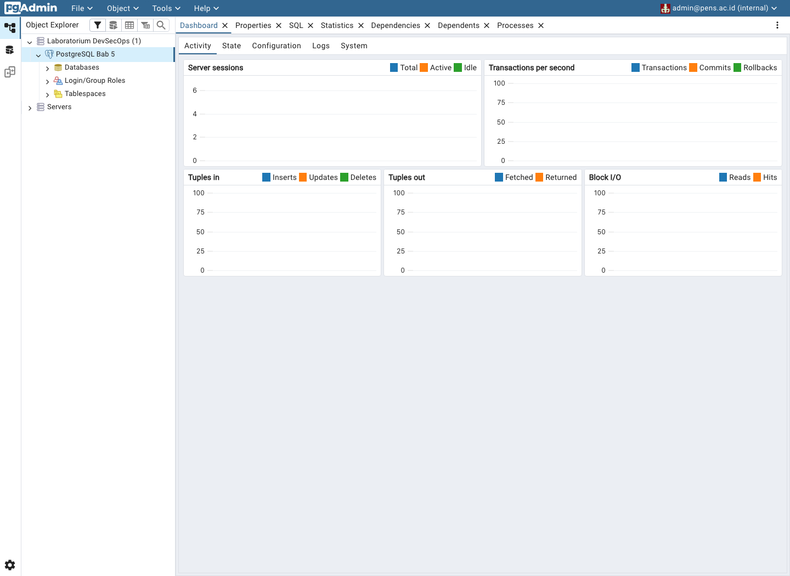

# BAB V: DATABASE SERVICE DI DOCKER: POSTGRESQL

**Nama:** Andi Rayka C · **NRP:** 3123640021 · **Kelas:** D4 LJ Informatika

## Pendahuluan

Praktikum ini menguji PostgreSQL 16 dan pgAdmin dengan Docker Compose. Saya membuat tabel `students`, memeriksa constraint, menguji named volume setelah container dibuat ulang, lalu memulihkan backup ke database terpisah. Port host memakai `127.0.0.1:15432` untuk PostgreSQL dan `127.0.0.1:15050` untuk pgAdmin agar tidak berbenturan dengan stack lain.

**Pernyataan penggunaan AI:** Saya menggunakan AI untuk merapikan latar belakang dan tujuan. Saya menjalankan praktikum dan mencocokkan uraian dengan hasil aktual.

## Dasar Teori

Image PostgreSQL menjalankan berkas SQL di `/docker-entrypoint-initdb.d` hanya ketika direktori data `PGDATA` masih kosong. Named volume menyimpan direktori itu di luar container. Karena itu, perubahan init script tidak mengubah database pada volume lama. Gunakan migrasi skema untuk perubahan berikutnya. Menghapus container tanpa menghapus volume mempertahankan data, sedangkan `docker compose down -v` menghapus volume [1, 3].

`pg_dump -Fc` membuat arsip logical yang dapat dipulihkan dengan `pg_restore` ke database lain. Checksum SHA-256 mendeteksi perubahan pada berkas, tetapi tidak membuktikan bahwa isi dapat dipulihkan. Uji restore dan bandingkan data sumber dengan hasilnya [2, 4].

File `.env` memudahkan konfigurasi laboratorium, tetapi bukan pengelola secret. Port loopback mencegah koneksi dari host lain, bukan dari pengguna atau proses lain pada komputer yang sama. Lingkungan produksi perlu secret manager, akun dengan hak minimum, image yang versinya dipatok, dan backup terenkripsi di lokasi terpisah.

**Pernyataan penggunaan AI:** Saya menggunakan AI untuk merangkum konsep volume, init script, dan backup. Saya memeriksa uraian terhadap cheatsheet dan dokumentasi yang dirujuk.

## Pelaksanaan Praktikum

File kerja ada di `lab/bab5/`. `compose.yaml` menjalankan `postgres:16-alpine` dan pgAdmin pada network Compose. `init/01-schema.sql` membuat tabel serta dua baris awal. `pgadmin/servers.json` mendaftarkan host `postgres-db`, yaitu nama service yang dapat diakses dari network Compose. Skrip `create-env.sh` membuat password acak ke `.env` dengan mode `600`; Git mengabaikan file tersebut dan direktori backup.

Saya menjalankan `./verify_lab.sh`. Skrip memeriksa konfigurasi, status health PostgreSQL, tabel dan constraint unik, penggantian container, backup beserta checksum, restore ke database terpisah, dan respons HTTP pgAdmin. Kedua port host hanya terikat ke loopback.

**Pernyataan penggunaan AI:** Saya menggunakan AI untuk menyusun konfigurasi Compose, skrip pemeriksaan, dan urutan langkah. Saya menjalankan skrip pada Docker lokal dan memeriksa hasilnya.

## Hasil dan Pembahasan

| Pemeriksaan | Hasil aktual |
| --- | --- |
| Service dan pgAdmin | PostgreSQL berstatus `healthy`. pgAdmin mengembalikan HTTP 302 ke halaman login; saya login dan menghubungkan server pada dashboard di Gambar 5.1. |
| Skema dan constraint | Tabel `students` berisi tiga baris. PostgreSQL menolak NRP `31230001` yang dimasukkan untuk kedua kalinya karena constraint `UNIQUE`. |
| Persistensi volume | Skrip menghapus container PostgreSQL, membuat container baru dengan ID berbeda, lalu membaca kembali `31230003:Mahasiswa Tiga`. Datanya tetap ada. |
| Backup dan restore | `pg_dump` menghasilkan arsip 3.394 byte dan checksum SHA-256 cocok. Restore ke `labdb_restore_test` mengembalikan tiga baris; hash isi tabel sama dengan database sumber. |

Masalah pertama muncul saat pgAdmin menolak alamat awal `admin@example.local`. Log validasi menyatakan domain itu termasuk domain khusus atau dicadangkan. Saya menggantinya dengan `admin@pens.ac.id`; login dan koneksi ke PostgreSQL kemudian berhasil. Perbaikan ini tidak mengubah credential PostgreSQL atau menghapus volume.

Risiko utama ialah credential environment dapat dibaca melalui Docker, backup hanya tersimpan di disk lokal, dan tag `dpage/pgadmin4:latest` dapat berubah. Untuk produksi, gunakan secret manager, role minimum, image yang dipatok, backup terenkripsi di lokasi terpisah, dan uji restore berkala.

Rincian hasil perintah tersimpan di `evidence/bab5/runtime-results.txt` dan `evidence/bab5/restore-results.txt`.

**Pernyataan penggunaan AI:** Saya menggunakan AI untuk mengelompokkan hasil dan menyusun analisis risiko. Saya membandingkan setiap klaim dengan hasil skrip, query PostgreSQL, dan dashboard pgAdmin.

## Evaluasi dan Latihan Mandiri

### Evaluasi

1. **Mengapa init script tidak berjalan ulang pada volume lama?** Image PostgreSQL hanya membaca init script ketika `PGDATA` kosong. Volume lama berisi state database, sehingga perubahan file SQL tidak dijalankan otomatis. Gunakan migrasi skema atau reset volume lab setelah membuat backup.

2. **Apa risiko menyimpan password di `docker-compose.yml`?** Password yang ditulis langsung dapat ikut ter-commit dan terlihat pada konfigurasi container. File `.env` mengurangi risiko commit, tetapi environment container masih dapat diperiksa oleh pihak yang memiliki akses ke Docker. Gunakan secret manager dan akun dengan hak minimum.

3. **Bagaimana membuktikan backup dapat dipulihkan?** Periksa ukuran dan checksum dump, pulihkan ke database terpisah, lalu bandingkan jumlah serta isi baris penting. Pada praktikum ini checksum cocok dan tiga baris pada `labdb_restore_test` menghasilkan hash isi yang sama dengan sumber.

4. **Apa beda logical backup dengan backup filesystem volume mentah?** `pg_dump` menyimpan objek dan data database dalam format logical yang dapat dipulihkan ke database lain. Salinan volume mentah mencakup berkas fisik `PGDATA`; penyalinan harus konsisten dengan transaksi dan terkait dengan versi serta mekanisme pemulihan PostgreSQL.

5. **Apa dampak `docker compose down -v`?** Perintah itu menghapus volume Compose, termasuk data PostgreSQL dan konfigurasi pgAdmin. Baris database tidak dapat dipulihkan dari volume yang terhapus tanpa backup lain.

### Latihan Mandiri

Saya menambahkan baris `31230003`, mencoba memasukkan ulang NRP `31230001`, lalu menghapus dan membuat ulang container PostgreSQL tanpa opsi `-v`. Constraint menolak data duplikat dan baris baru tetap ada. Saya membuat dump, memulihkannya ke `labdb_restore_test`, serta membandingkan isi kedua database. Semua pemeriksaan lulus.

## Kesimpulan

Praktikum membuktikan bahwa named volume mempertahankan data ketika container PostgreSQL diganti. Constraint unik menolak NRP duplikat, sedangkan checksum dan uji restore membuktikan backup dapat dipakai untuk memulihkan tiga baris ke database terpisah. Konfigurasi ini cocok untuk laboratorium lokal, tetapi belum memenuhi kebutuhan secret management, retensi backup di lokasi terpisah, atau versi image yang dipatok untuk produksi.

**Pernyataan penggunaan AI:** Saya menggunakan AI untuk menyunting ringkasan. Kesimpulan mengikuti hasil praktikum, bukan perkiraan.

## Daftar Pustaka

1. Ferryas PENS, [Materi DevSecOps Bab 5: Database Service di Docker](https://github.com/ferryas-pens/devsecops/blob/main/bab-05.md).
2. Ferryas PENS, [Cheatsheet Bab 5: PostgreSQL, pgAdmin, Volume, Backup, dan Restore](https://github.com/ferryas-pens/devsecops/blob/main/cheatsheets/bab-05-cs.md).
3. Docker, [Volumes](https://docs.docker.com/engine/storage/volumes/).
4. PostgreSQL Global Development Group, [PostgreSQL 16: pg_dump](https://www.postgresql.org/docs/16/app-pgdump.html) dan [pg_restore](https://www.postgresql.org/docs/16/app-pgrestore.html).
5. pgAdmin Development Team, [Import/Export Servers](https://www.pgadmin.org/docs/pgadmin4/latest/import_export_servers.html).

**Pernyataan penggunaan AI:** AI membantu saya menemukan sumber. Saya memeriksa tautannya.
